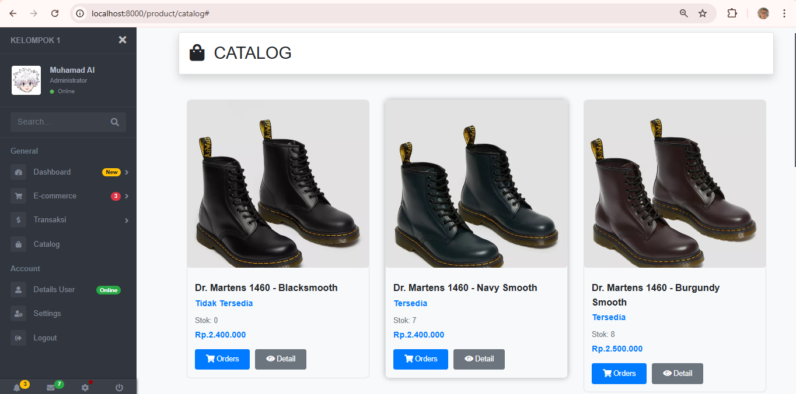
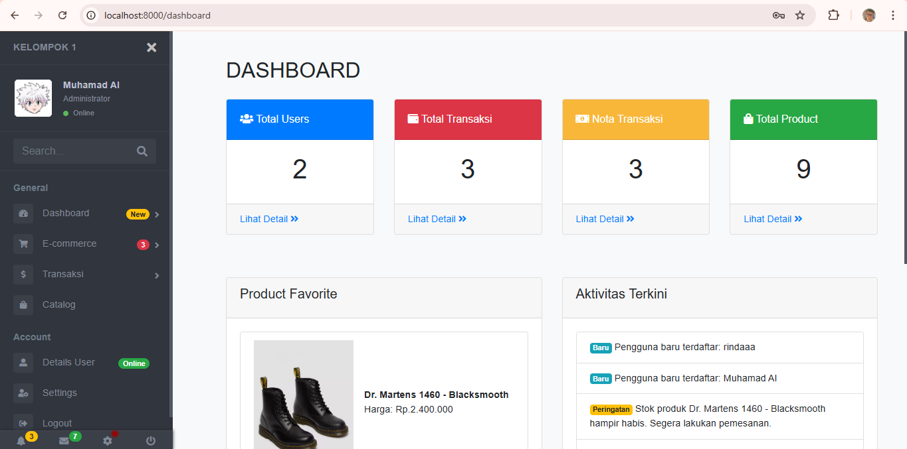
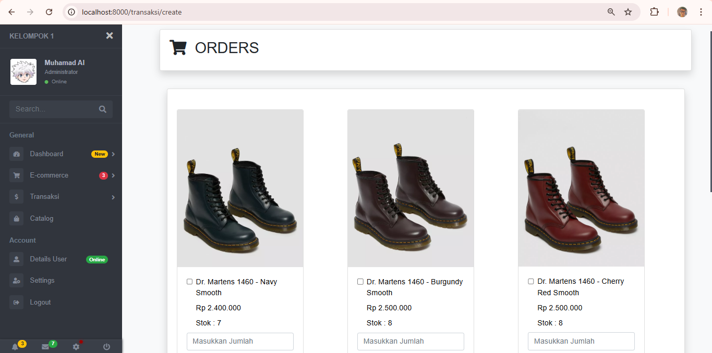

# E-Commerce Laravel

Sebuah aplikasi e-commerce yang dibangun menggunakan Laravel framework dengan fitur lengkap untuk manajemen toko online.

## 🚀 Fitur Utama

### Untuk Customer
- **Registrasi & Login** - Sistem autentikasi pengguna
- **Katalog Produk** - Browse dan pencarian produk
- **Shopping Cart** - Keranjang belanja dengan update real-time
- **Checkout** - Proses pembelian yang aman
- **Order History** - Riwayat pesanan dan tracking
- **Profil User** - Manajemen data pribadi
- **Wishlist** - Daftar produk favorit
- **Review & Rating** - Sistem rating dan review produk

### Untuk Admin
- **Dashboard Admin** - Panel kontrol administrasi
- **Manajemen Produk** - CRUD produk, kategori, dan stok
- **Manajemen Order** - Kelola pesanan dan status pengiriman
- **Manajemen User** - Kelola data pelanggan
- **Laporan Penjualan** - Analytics dan reporting
- **Manajemen Kategori** - Organisasi produk
- **Pengaturan Web** - Konfigurasi toko

## 🛠️ Teknologi yang Digunakan

- **Backend**: Laravel 10.x
- **Frontend**: Blade Template Engine
- **Database**: MySQL
- **CSS Framework**: Bootstrap 5 / Vanilla CSS
- **JavaScript**: jQuery / Alpine.js
- **Package Manager**: Composer & NPM

## 📋 Persyaratan Sistem

- PHP >= 8.1
- Composer
- Node.js & NPM
- MySQL >= 5.7
- Apache/Nginx Web Server

## 🔧 Instalasi

### 1. Clone Repository
```bash
git clone https://github.com/littlesuccumb/E-Commerce-Laravel.git
cd E-Commerce-Laravel
```

### 2. Install Dependencies
```bash
# Install PHP dependencies
composer install

# Install JavaScript dependencies
npm install
npm run dev
```

### 3. Konfigurasi Environment
```bash
# Copy environment file
cp .env.example .env

# Generate application key
php artisan key:generate
```

### 4. Konfigurasi Database
Edit file `.env` dan sesuaikan konfigurasi database:
```env
DB_CONNECTION=mysql
DB_HOST=127.0.0.1
DB_PORT=3306
DB_DATABASE=alproject
DB_USERNAME=root
DB_PASSWORD=
```

### 5. Setup Database

**Opsi 1: Import SQL File (Recommended)**
```bash
# Buat database baru
mysql -u root -p -e "CREATE DATABASE alproject;"

# Import file SQL yang sudah disediakan
mysql -u root -p alproject < alproject.sql
```

**Opsi 2: Menggunakan Laravel Migration**
```bash
# Jalankan migrasi
php artisan migrate

# Jalankan seeder (opsional)
php artisan db:seed
```

### 6. Storage Link
```bash
# Buat symbolic link untuk storage
php artisan storage:link
```

### 7. Jalankan Aplikasi
```bash
# Development server
php artisan serve
```

Buka browser dan akses `http://localhost:8000`

## 🗄️ Struktur Database

### Tabel Utama
- `users` - Data pengguna (admin & customer)
- `categories` - Kategori produk
- `products` - Data produk
- `orders` - Data pesanan
- `order_items` - Detail item pesanan
- `cart` - Keranjang belanja
- `reviews` - Review dan rating produk
- `wishlists` - Daftar favorit pengguna

## 🎯 Penggunaan

### Admin Panel
1. Akses `/admin` untuk masuk ke panel admin
2. Login menggunakan kredensial admin
3. Kelola produk, kategori, dan pesanan melalui dashboard

### Customer
1. Registrasi akun baru atau login
2. Browse produk dan tambahkan ke keranjang
3. Checkout dan lakukan pembayaran
4. Pantau status pesanan di halaman profil

## 🔐 Akun Default

Jika menggunakan seeder, akun default yang tersedia:

**Admin:**
- Email: `admin@example.com`
- Password: `password`

**Customer:**
- Email: `customer@example.com`
- Password: `password`

## 📝 API Documentation

API endpoints tersedia untuk integrasi:

### Authentication
- `POST /api/login` - Login user
- `POST /api/register` - Registrasi user
- `POST /api/logout` - Logout user

### Products
- `GET /api/products` - List produk
- `GET /api/products/{id}` - Detail produk
- `GET /api/categories` - List kategori

### Orders
- `POST /api/orders` - Buat pesanan
- `GET /api/orders` - Riwayat pesanan
- `GET /api/orders/{id}` - Detail pesanan

## 🧪 Testing

Jalankan unit tests:
```bash
# Jalankan semua tests
php artisan test

# Jalankan test spesifik
php artisan test --filter ProductTest
```

## 🚀 Deployment

### Production Setup
1. Set environment ke production di `.env`:
```env
APP_ENV=production
APP_DEBUG=false
```

2. Optimize aplikasi:
```bash
php artisan config:cache
php artisan route:cache
php artisan view:cache
php artisan optimize
```

3. Set permission yang sesuai untuk folder storage dan bootstrap/cache

## 🤝 Kontribusi

1. Fork repository ini
2. Buat feature branch (`git checkout -b feature/fitur-baru`)
3. Commit perubahan (`git commit -am 'Menambah fitur baru'`)
4. Push ke branch (`git push origin feature/fitur-baru`)
5. Buat Pull Request

## 📄 Lisensi

Project ini menggunakan lisensi MIT. Lihat file [LICENSE](LICENSE) untuk detail.

## 📞 Kontak & Support

- **Developer**: [littlesuccumb](https://github.com/littlesuccumb)
- **Email**: -
- **Issues**: [GitHub Issues](https://github.com/littlesuccumb/E-Commerce-Laravel/issues)

## 📸 Screenshots

### Product Catalog


### Admin Dashboard


### Shopping Cart


---

⭐ Jika project ini membantu Anda, jangan lupa berikan star di repository ini!

## 🔄 Changelog

### v1.0.0
- ✅ Implementasi fitur dasar e-commerce
- ✅ Panel admin lengkap
- ✅ Sistem autentikasi
- ✅ Shopping cart & checkout
- ✅ Order management

### Upcoming Features
- 🔄 Payment gateway integration
- 🔄 Multi-vendor support  
- 🔄 Advanced analytics
- 🔄 Mobile app API
- 🔄 Email notifications
